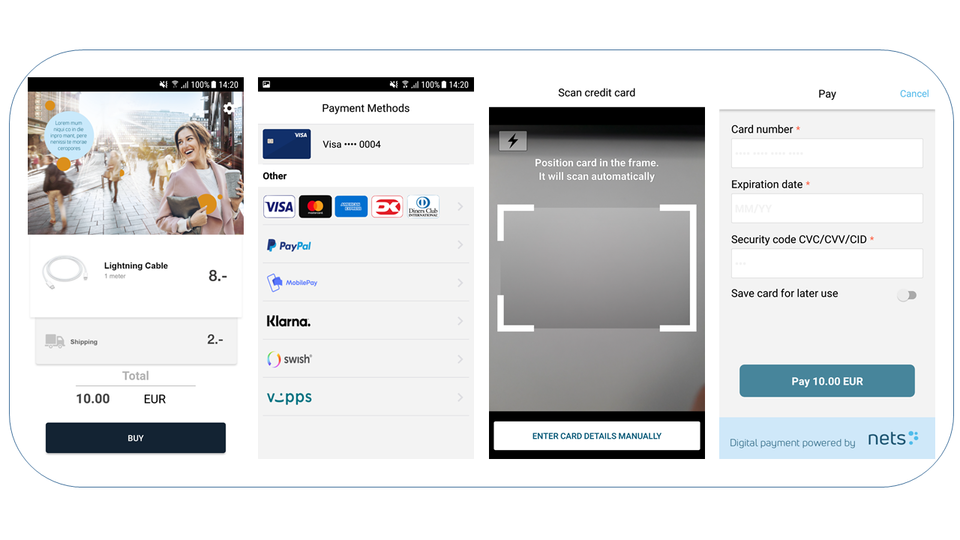

# PiA - Netaxept Android SDK v1.1.1
----


PiA Netaxept Android SDK is a library that provides the native In-App interaction of performing the Netaxept payment directly from an app on the Android device and minimizes PCI DSS requirements for you.

**PiA - Netaxept iOS SDK** can also be found [here](https://github.com/Nets-mobile-acceptance/Netaxept-iOS-SDK)

|   |  |
| --- | --- |


# Installation
----
In your `build.gradle` application level file, add:
```gradle
implementation('eu.nets.pia:pia-sdk:1.1.1') { transitive = true; changing=true; }
```

**Important:** for the release version of your _.apk_, add the following rules in your application's `proguard-rules.pro` file:
```java
#Rules required by Card.Io library
-keep class eu.nets.pia.cardio.** { *; }
-dontwarn eu.nets.pia.cardio.**
```
    
**Note:** the library is available through both `jcenter()` and `mavenCentral()` repositories.


# Requirements
----
**Minimum supported Android version is 5.0** - Due to PCI DSS requirements and known vulnerabilities in secure protocols less than TLS 1.2, TLS 1.2 is the only secure protocol available when connecting towards Netaxept. For this reason, we don't support the Android versions lower than 5.0 which are NOT enabled/supported TLS 1.2 by default. For more information, you can check the details from Netaxept.


# Permissions
----
These permissions are handled inside the binary, and your integration won't require any additional changes.

**PiA SDK** will require the internet permissions to be fully operational.

```xml
<uses-permission android:name="android.permission.INTERNET" />
```

**CardIo** library integrated by PiA SDK will also require permission for Camera and Vibrate.

```xml
 <uses-permission android:name="android.permission.CAMERA" />
 <uses-permission android:name="android.permission.VIBRATE" />
```

# Examples
----

We have provided a [Sample Application](PiaSample/) to help you understand the use cases of the SDK functionalities. All you need to do is to setup your Back-End solution with Netaxept ([see more](https://github.com/Nets-mobile-acceptance/Netaxept-Sample-Backend)), get the source code (check [ReadMe](PiaSample/ReadMe.md) on how to do basic setup) and then run it. 


# Project Status
---
Supported payment methods:
- Cards
     - Visa
     - Mastercard
     - American Express
     - Diners
     - JCB
     - Dankort
     - PayPal
- Nordic mobile wallets (Vipps, Swish, MobilePay) – available soon

# Releases

New releases (improvements and fixes) since `v1.0.0`:

- `v1.1.0`: Released on 18-Dec-2018
	+ **Security improvement:** Payment parameters passed by the SDK to the backend are now sent through a **POST**. The **GET** request is discontinued
    + **Xamarin** and **ReactNative** support
    + Fixed logo issue for _DinersClubInternational_ recurring payments
    + Improved _PiaSDK.start()_ to accept _Fragment_ parameter
    + New configuration to disable card scanner
	
- `v1.1.1`: Released on 25-Jan-2019
	+ Improvements for UI Customization:
		- added new flag for hiding the "Save card for later use" functionality from payment screen
		- added new option for setting custom background color for input fields
		- updated card logos
	+ Improvements in WebView navigation bar: replaced text with specific icons 


# Usage
----
Depending on your selected payment method, the SDK can be launched in multiple functionalities: **Register Card, Basic Payment, Easy Payment, PayPal Payment** etc. Please check our full [documentation](documentation/) to see more.

In the example below, the SDK is launched to perform a payment with a new card.

- Create you own RegisterPayment handler, implementing the SDK's `RegisterPaymentHandler`

```java
    public class RegisterPaymentHandlerImpl implements RegisterPaymentHandler {
         @Override
        public TransactionInfo doRegisterPaymentRequest(boolean saveCard) {
            PaymentFlowCache paymentFlowCache = PaymentFlowCache.getInstance();
            PaymentRegisterRequest paymentRegisterRequest = paymentFlowCache.getPaymentRegisterRequest();
            paymentRegisterRequest.setStoreCard(saveCard);

            MerchantRestClient.getInstance().registerPayment(paymentRegisterRequest);

            if (!paymentFlowCache.finishedWithError()) {
                PaymentRegisterResponse registerResponse = paymentFlowCache.getPaymentRegisterResponse();
                return new TransactionInfo(registerResponse.getTransactionId(),
                        registerResponse.getRedirectOK(),
                        registerResponse.getRedirectCancel());
            }

            return null;
        }
    }
```

- Initialize and launch SDK to perform payment:

```java
    public class MainActivity extends AppCompatActivity {

        private RegisterPaymentHandler mRegisterPaymentHandler;
        private static final String CURRENCY = "EUR";
        private static final String ORDER_NUMBER = "PiaSDK-Android";

         @Override
        protected void onCreate(Bundle savedInstanceState) {
            super.onCreate(savedInstanceState);
            mRegisterPaymentHandler = new RegisterPaymentHandlerImpl();

        }

        private MerchantInfo getMerchantInfo() {
            return new MerchantInfo(BuildConfig.MERCHANT_ID);
        }

        private OrderInfo getOrderInfo() {
            String priceString = mPriceView.getText().toString();
            double price = priceString.isEmpty() ? 0 : Double.parseDouble(priceString);

            return new OrderInfo(
            price,
            CURRENCY
            );
        }

        private void callPiaSDK(PaymentMethod method) {
            Bundle bundle = new Bundle();
            bundle.putParcelable(PiaActivity.BUNDLE_MERCHANT_INFO, getMerchantInfo());
            bundle.putParcelable(PiaActivity.BUNDLE_ORDER_INFO, getOrderInfo());
            PiaSDK.getInstance().start(MainActivity.this, bundle, mRegisterPaymentHandler);
        }
    }
```

- In the activity which launched the SDK, override the `onActivityResult()` to handle the SDK result:

```java
...
        @Override
        protected void onActivityResult(int requestCode, int resultCode, Intent data) {

            if (requestCode != PiaSDK.PIA_SDK_REQUEST) {
                super.onActivityResult(requestCode, resultCode, data);
                return;
            }

            //in case user cancelLed
            Bundle bundle = new Bundle();
            if (resultCode == RESULT_CANCELED) {
                rollbackTransaction();
                return;
            }

            if (resultCode == RESULT_OK) {
                PiaResult result = data.getParcelableExtra(PiaActivity.BUNDLE_COMPLETE_RESULT);
                if (result.isSuccess()) {
                    //in case of success, commit the payment
                    mRestClient.commitPayment(
                                mPaymentCache.getPaymentRegisterResponse().getTransactionId()
                            );
                } else {
                    // Otherwise, handle the failure case
                }
            }
        }
...
```


# Contact
----
If you have any question or feedback, please contact us via email: [mobile-acceptance@nets.eu](mailto:mobile-acceptance@nets.eu)


# License
----

Please check [License file](PiA-Netaxept-SDK-License.md).
